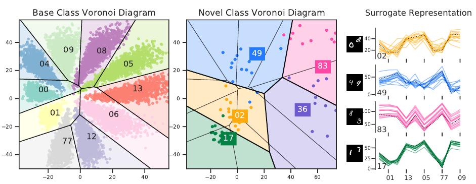

# DeepVoro: Few-shot Learning as Cluster-induced Voronoi Diagrams (ICLR 2022)

<div align="center">
  <a href="https://openreview.net/forum?id=6kCiVaoQdx9">OpenReview</a>
</div>
<div align="center">
  <a href="https://arxiv.org/abs/2202.02471">arXiv</a>
</div>

<p align="center">
  
</p>

If you find the software useful please consider citing:

```
@misc{ma2022fewshot,
      title={Few-shot Learning as Cluster-induced Voronoi Diagrams: A Geometric Approach}, 
      author={Chunwei Ma and Ziyun Huang and Mingchen Gao and Jinhui Xu},
      year={2022},
      eprint={2202.02471},
      archivePrefix={arXiv},
      primaryClass={cs.LG}
}
```

or:

```
@inproceedings{ma2022fewshot,
    title={Few-shot Learning via Dirichlet Tessellation Ensemble},
    author={Chunwei Ma and Ziyun Huang and Mingchen Gao and Jinhui Xu},
    booktitle={International Conference on Learning Representations},
    year={2022},
    url={https://openreview.net/forum?id=6kCiVaoQdx9}
}
```
